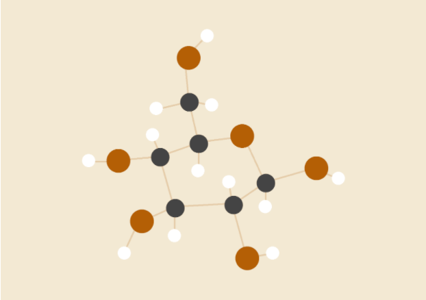
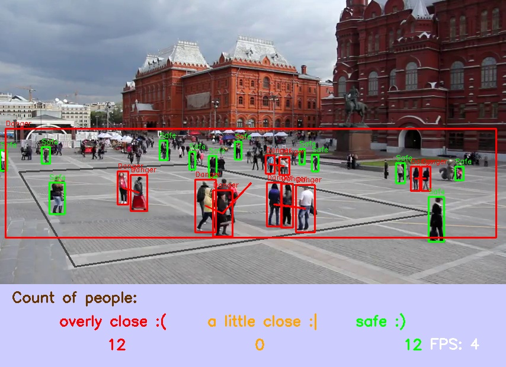
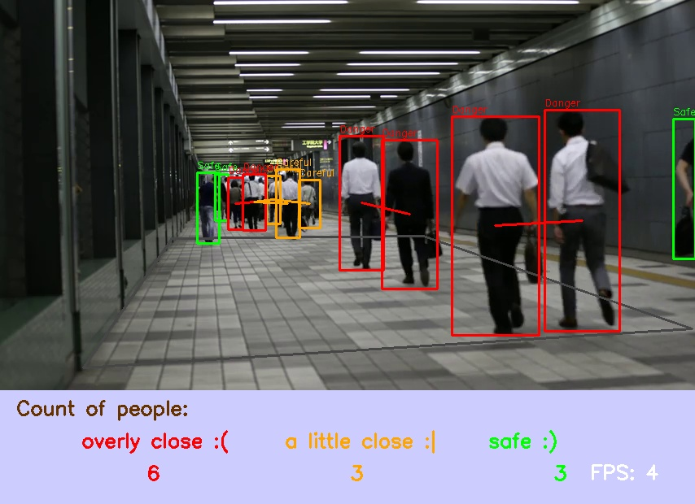
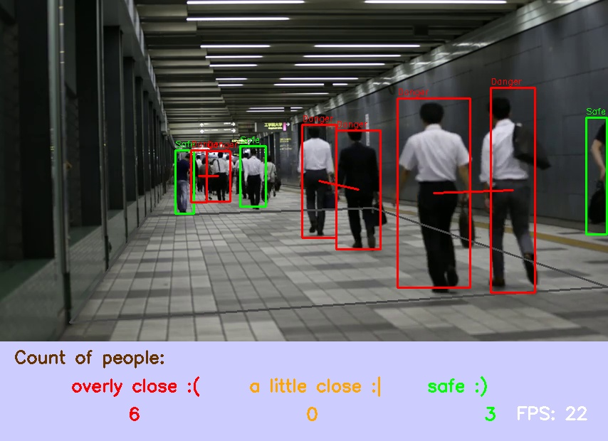
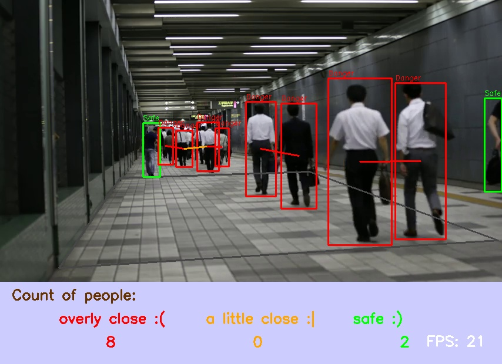
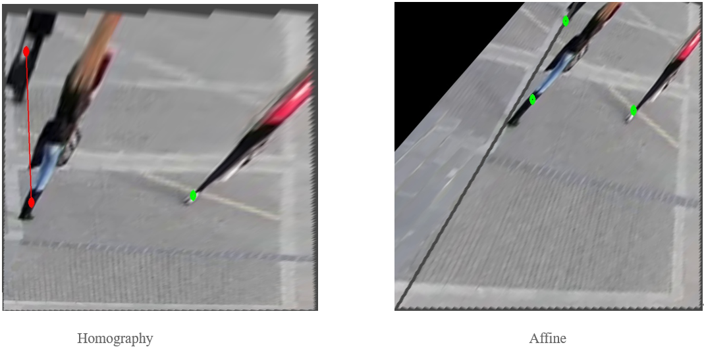
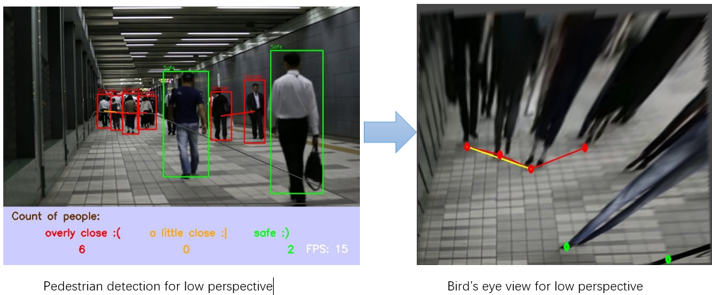
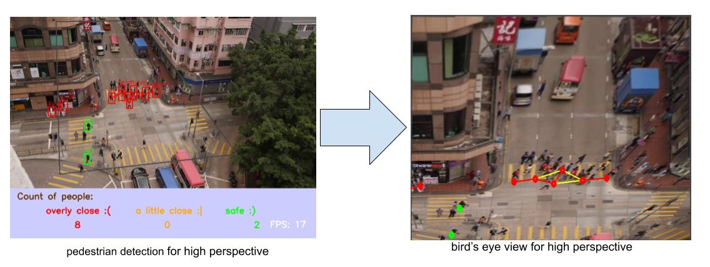
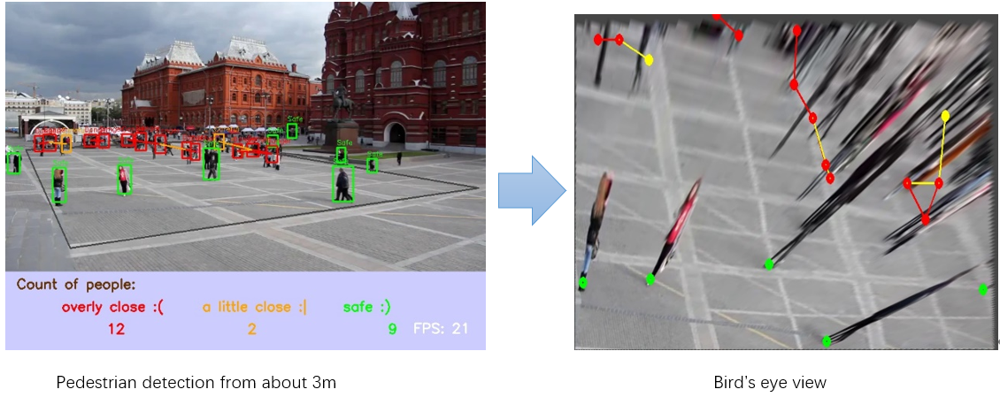

## Real-time Social Distance Detection System

### University of Toronto, Introduction to Image Understanding

**Hanlai Chen, Yexiong Xu, Qinxi Yu**

2020/12/01

[https://github.com/quincy-u/social-distance-detector](https://github.com/quincy-u/social-distance-detector)

[Link to the models we use](https://drive.google.com/drive/folders/1wzVypThZzSWX0Ja-uZJoGOMg4KQIQ0Pu?usp=sharing)

## Abstract

Due to the outbreak of COVID-19, many researchers have concluded that maintaining a social distance of at least 6ft is a very effective measure to slow down or even stop the spread of the virus. Many cities have introduced rules to limit their citizens to interact with each other. Social Distance Detector is a program that automatically detects and raises an alarm when people are too close to each other. The application of this program can help to slow down the spread of the virus and at the same time increase people’s self-awareness.

Social Distance Detection is a new topic since the outbreak in late 2019, there is not so much solution out there. However, object detection and perspective transformation are no longer new topics, and they have been studied for years.

We implement a  real-time social distance detector. The detection model is composed of a neural network detecting the pedestrians and a transformation mapping the camera-perspective image into its bird-eye view. Then the model can calculate the distances between pedestrians and warn if they are too closed to each other. For the purpose of real-time performance,  we are using the YOLOv4 model as our detection model since the YOLOv4 model can detect pedestrians fast while keeping a high accuracy.

## Introduction & Literature Review

There are two main parts of our social distance detection model. We will introduce each of these ideas briefly below and then describe them in detail later.

The first part of the model is to detect pedestrians. We are using the YOLOv4 model. Most object detection algorithms can be categorized into two parts, one stage detection and two stage detection algorithm. Two stage algorithms would first generate some region for the object’s potential positions. Then at the second stage, it would refine the location and do the classification. The two stage approach can ensure the maximum accuracy , however, one drawback is that the speed of those algorithms is not ideal for real-time applications. On the contrary, one stage detection algorithms like YOLO and SSD use the neural net to predict position and classify the object at the same time. One stage algorithm has advantages on speed over the two stage one, while it still preserves a reasonable accuracy. They are mainly adopted to some real-time applications like social distance detection. Here we choose YOLOv4 as our object detection algorithm.

 YOLOv4 consists of only convolutional layers unlike YOLOv1 (convolutional layers and connection layers). It controls the size of feature maps by controlling the size of the convolutional layers. YOLOv4 produces 3 feature maps for detecting objects with different sizes. Larger feature maps for small objects and smaller feature maps for large objects. In YOLOv4 the feature maps have size N * N * 3 * (4 + 1 + 80), and N is the dimension of the feature maps and 3 is the number of anchor boxes. Each of them has parameters x, y, w, h, confidence of the box’s location and probabilities of 80 classes. The original YOLOv4 model has 137 convolutional layers[1]. To spend less time on processing one image, we use a tiny YOLOv4 model composed of 38 layers with 29 convolutional layers[2], and have feature map sizes of N * N * 3 * (4 + 1 + 1) = N * N * 18. We down-sampled the image 32 times, utilized 3 by 3 and 1 by 1 convolutional layers to produce the feature map.  Due to the fact that the existing YOLO model parameters are trained to classify 80 objects, we trained our own model parameters to classify only 1 class (pedestrian).

The second part of the model is to apply transformation. We map the camera-perspective image into a bird-eye-view image then we can calculate the social distances between people. Utilizing homography transformation[3], we obtain the transformation matrix for transforming our coordinates and each frame. The homography matrix is a 3 by 3 matrix but it has only 8 degrees of freedom. Then the matrix can be easily solved by obtaining 4 points. We did some experiments on several transformation methods and all of them achieve similar results except affine transformation. 

Then we have the positions of each pedestrian on the bird-eye-view and we can calculate the euclidean distance between each other.

Our program can detect up to 49 people at the same frame and can run with 20-25fps on CPU and 60 - 75fps on GPU. The mean average precision of our self-trained model is 53%. Note that below we might use the YOLOv4 model as an example to our comparison since YOLOv4 is the latest model trained by the author. The 

## Methodology

In the Social Distance Detector, the most important feature is object detection and perspective transformation. For example, in order to measure the distances between pedestrians, object detection is applied to each frame of the video to locate every pedestrian. Then distances are calculated using the coordinate of each person on the transformed frame. Also, concepts of Affine Transformation and Ransac could also be used for the perspective transformation.

**Object Detection Method**

There are many object detection algorithms such as R-CNN, SPP, Fast R-CNN, Faster R-CNN, Feature Pyramid networks, RetinaNet(Focal loss), SSD, and Yolo(v1,v2,v3, v4). The most popular algorithms are R-CNN and Yolo.** **R-CNN is known as Region-based Convolutional Neural Networks published by Ross Girshick, Jeff Donahue, Trevor Darrell, Jitendra Malik in 2014[4]. R-CNN is a combination of regional proposals with CNN. It has the capability to scale without resorting to approximate techniques. Another well-known algorithm is called Yolo (You look only once), the architecture of Yolo would first split the input into m by m grid and for each grid, it generates two bounding boxes and class probabilities for those boxes.

For the purpose of real time detection, we choose to use Yolo since its response is much faster. We did some experiments on how to balance our model to obtain the desired accuracy while maintaining a high frame rate. We use a smaller yolo architecture also provided in darknet. The tiny model has 29 convolution layers hence the speed is appealing however, the accuracy is decreased. Since the yolo model from darknet is trained to detect multiple objects while we only care about human detection. Hence we tried to train our own model based on the tiny architecture to achieve a better accuracy with same runtime speed. The input size of the net is the same as the original version which is 416 * 416 * 3. This can be adjusted if we want to balance between accuracy and speed. Then down-sample the image 32 times by different size filters. At the end, the output layers has size of N/32 * N/32 * 3 * (4 + 1 + 1) = 416/32 * 416/32 * 18 = 13 * 13 * 18. Where N is the dimension of the input image, 3 represents 3 anchor boxes used to draw, 4 represents the dimension of the parameters of the size and  the position of the boxes, 1 represents the confidence of each anchor box, and the final 1 represents the probability of each class [5]. We have 1 here because our model only detects pedestrians. The graph is the detailed architecture we used.

The original data consists of about 80000 training samples and 40000 validation samples. Due to the large mess of data, it could result in a long training time of several days. We then filter the image examples and then train on a smaller subset of all the original samples. The first strategy we take is to filter out all images with no person label. It reduces a half of the size of our dataset. However, there are still a lot of samples. Then we apply a second strategy to filter out the images with too few people. We also filter out images where one person takes too much space of the image such as a profile image. The two strategies reduce our sample size to about 7000 training samples and 3000 validation samples which saves a lot of training time.

It turns out that the trained model has better mean average precision than the yolov4 tiny model given in darknet. Although its mean average precision is slightly lower than the yolov4 original model. However, our trained model has a much smaller running time. We will later show the comparison between our trained model and the large model provided in darknet.

The forward pass is done by the open-cv dnn package, which takes our model and generates boxes with the given confidence and class probability. Then we use open-cv built-in non-maximum suppression to filter out some weak overlapping boxes. Now we have people detected with boxes around, then we will discuss how we calculate the distance.

**Transformation**

The big idea is that we use homography to find the transformation matrix then get the bird eye view. Using the bird eye view we can calculate the distance between each person and compare their social distance. In our homography function, we need 4 pairs of matching points from our new plane and from our original frame, and the scale of two axises to calculate the real world distance.  

In this algorithm, first, we have to represent the image in a shifted coordinate system, next we perform a rotation of the image, and then project the enlarged image on a 2d plane.

## Experiments

**Different Trained Models**

The reason why we choose YOLOv4 is that we want to have a real-time performance for detection. And YOLOv4 is one of the fastest object detection algorithms with reasonable accuracy. For our program we trained our own model based on a YOLOv4-tiny architecture model. A comparison between the performance of the different models is made. We have the following three models for comparison. YOLOv4 a model trained with a 137 layers convolutional neural network by the author of the darknet, YOLOv4-tiny a model trained with 29 layers convolutional neural network by the same author, and YOLOv4-pedestrian a model trained with 29 layers convolutional neural network by us. The following tests ran on intel i7-8700k@5.0GHz.

**                        **YOLOv4
               
**                        **YOLOv4-tiny

**              ** YOLOv4-pedestrian

From the comparison of our experiment, we see that our model has the speed of YOLOv4-tiny model, while the model has similar performance of the YOLOv4 model. YOLO object detection algorithm does a poor job classifying small objects, due to the fact that each grid is only responsible for one object. And there are limits on the minimum size of each grid due to performance concerns. An example is that from the first set of comparison, there is a large box in YOLOv4 model, this might be caused by misclassifying a small object. That would lead to an observation that higher mAP does not always result in a better performance in terms of clarity. Despite the fact that YOLOv4 has a better bounding box and could find a more accurate position based on it, this model has slow speed.

**                        **YOLOv4
               
**                        **YOLOv4-tiny

**              ** YOLOv4-pedestrian

Unlike YOLOv4, YOLOv4 tiny has only 29 convolutional layers, it runs at 20-25 frames per second. The accuracy decreases, and small objects are harder to be detected. However, since we trained our model based on some dataset with small group of people, the model adapted some of the YOLOv4 behaviours while maintaining the YOLOv4-tiny model’s speed. It is now more sensitive to small objects than the YOLOv4-tiny model. We can see from both examples, some of the small people are captured by our model, and only a few small people are captured by the YOLOv4-tiny model. However, due to the maximum number of grids and the size of them, all of the models fail to classify most of the small people.

In all, our model maintains most of the performance of the YOLOv4 model while obtains the speed of the YOLOv4-tiny model.

**Different Transformation**

We experimented on applying different transformation methods when we tried to map the camera-perspective image into bird-eye-view image. We tried homography transformation and affine transformation. We also tried to implement our own homography transformation. We expected homography to work better than affine transformation since lines that are parallel in reality can not be guaranteed to be parallel in the camera-perspective image. 

                    

You can see in the comparison of the final bird-eye-view image, homography works much better. Hence we are finally using homography transformation.

**Different Camera Perspective**

Some other experiments we tried are to test the models on videos with different camera heights. If the camera’s height is too low, we may have a terrible bird’s eye view, and we can only calculate limited pedestrians due to the blockage of the nearby objects.

If the camera is too high, we can have a perfect bird’s eye view of the pedestrians, but we may have some trouble detecting pedestrians. Due to the architecture of yolo, small objects are harder to predict and cameras from a high perspective tend to capture people of small size on the image. Hence some people cannot be detected as shown in the graph. 

We believe the camera from height about 3 meters will best suit because the video can be easily transformed to a sensible bird’s eye view video. Although there are lots of people in the graph, we can still detect most of them.

## Result

The final version of our program utilized YOLOv4-pedestrian as our model for object detection. The mean average precision (mAP@0.5) is 53%, and the average frame rate is 21.3 fps [[^1]]. The overall performance is great, it detects an average of 70% of the pedestrians, and the positions of bounding boxes are 90% correct. The positions of the pedestrians on the bird eye view have the error of less than 0.1 meter [[^2]]. The program works the best when the camera is installed 3 meters above the ground, and the source video should have a frame rate no more than  20-25 to obtain a real-time performance. The homography transformation provides an almost perfect bird eye view if the ground surface is flat, however, due to the low resolution of the input video, some far away spots would be blurry. Some parameters are chosen for object detection. We choose confidence of 0.3 for the probability and 0.1 for non-maximum suppression algorithm in order to achieve best result. 

## Conclusion

The program offers a novel way to detect and potentially control crowds in some densely populated areas in order to stop the spareting of the coronavirus. The program could run in real time and provide sufficient accuracy to raise the alarm when people are too close to each other. Despite the fact that the detection is unstable due to some blockages caused by overlaying, we can still stabilize the detection algorithm and improve our program by applying some threshold period. Which would only raise the alarm when some people are too close to each other for too long. 

There are also some known issues of our program we would like to adjust. The detection performs poorly when the object is small. One way of improving this is that we could try different object detection algorithms like SSD or we can simply apply threshold to prevent detecting small objects. The second issue is that the transformated bird eye view has a blurry section caused by low resolution. And one possible way to adjust it is to utilize some deep learning super resolution algorithm that is proposed to the other group. The third issue is that the speed of the program might not be sufficient for some low-end processors. Since the effect of the social distance detection system scales only if there are enough of them installed. And the cost of installing cameras with high-end processors is inconsiderable. Therefore, making our program to adapt low-end devices is also a tricky question. 

All in all, the program works correctly and it will offer a new method to prevent the corona virus from spreading. To make our program more concrete and realistic, we are looking forward to continuously improving it in the future. If the virus is not controlled which is what we do not want to see.

## Authors’ contributions:

All of us took part in the design and the research of our project. Meetings are called to ensure the works are done by all of the members. Here is a detail of our contributions. Hanlai Chen is responsible for data gathering and preprocessing. He wrote scripts for modifying and selecting data. He is also responsible for researching and training the YOLOv4-pedestrian model (YOLOv4-tiny-pedestrian-last.weight and YOLOv4-tiny-pedestrain.cfg). 

Yexiong Xu is responsible for… 

Qinxi Yu is responsible for…

The team progresses as a whole and all members are kind enough to help to diagnose and debug for other members. Every member is positive and contributed. The presentation and the report are also created by all members aach responsible for their section.   

## References

[1] [https://arxiv.org/pdf/2004.10934.pdf](https://arxiv.org/pdf/2004.10934.pdf)

[2] https://github.com/AlexeyAB/darknet

[3] M.Venkatesh, P.Vijayakumar, 2012. Transformation Technique. [online] Available at:&lt;https://www.ijser.org/researchpaper/A-Simple-Birds-Eye-View-Transformation-Technique.pdf> [Accessed 4 November 2020].

[4] UC Berkeley, 2014. Rich Feature Hierarchies For Accurate Object Detection And Semantic Segmentation. [online] Available at: &lt;https://arxiv.org/pdf/1311.2524.pdf> [Accessed 4 November 2020].

[5] Redmon, J., Divvala, S., Girshick, R. and Farhadi, A., 2016.You Only Look Once: Unified, Real-Time Object Detection. [online] Available at: &lt;https://arxiv.org/pdf/1506.02640.pdf> [Accessed 4 November 2020].

[...] 

<!-- Footnotes themselves at the bottom. -->
## Notes

[^1]:
       All tests are run on intel i7-8700k@5.0GHz CPU, and the result also depends on input resolution

[^2]:
       The error depends on the input error, here we assume there is no error on our input

